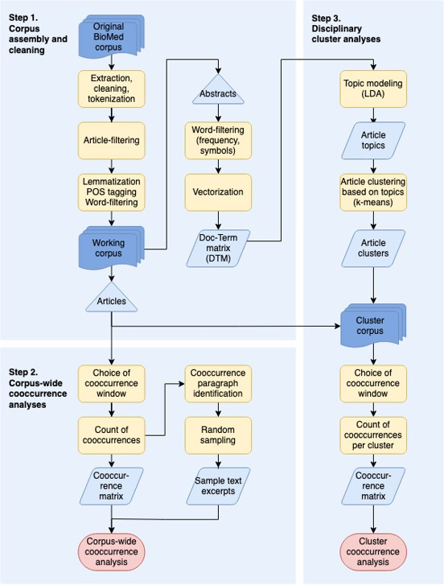

Charting
========

The 3 "run_step..." scripts correspond to the 3 main steps described in the methods section of the article, as presented in the diagram below. 

Simply edit the config file `charting_config.py` and update the PATH variables to match your local configuration.
Make sure 

Scripts can then be run in order, execution details will be printed to the terminal.
The process can be quite lengthy and somme steps will require several hours if working with the whole corpus.

#### Notes on reproducibility

To ensure reproducibility, LEGACY_MODE should be set to True in `charting_config.py`
This will 

Some minor corrections were made to the text extraction process late in the project, after we found out some non-text content -mostly urls- had filtered through.
Corrections were made, but after the working corpus was built based on the 150 words abstract / 2000 words text threshold.
After these corrections, a handful of documents (a few dozens) ended up being slightly (most by 10 words or less) below the 150 words abstract / 2000 words text threshold.
If using legacy mode, the working corpus will be built from a list of doc ids, in order to include these documents.
Else, the process will be run from scratch, and thoses files will be excluded from the working corpus.

The code used to compute the docterm matrix was refactored before publishing, to improve performance and reusability.
While this had no effect on the values themselves, it did change the ordering of the rows and columns within the matrix.
However, this reordering 
In order to reproduce the exact same output from the LDA topic modeling, a manual reordering based on the original configuration is required.

If the value of `LEGACY` in `charting_config.py` is set to `True` (it is by default), these changes will be taken into account in order to reproduce exact results found in the publication.
If set to `False`, everything will be run from scratch, so the LDA results might differ slightly , although the overall picture and conclusions should not be affected.
